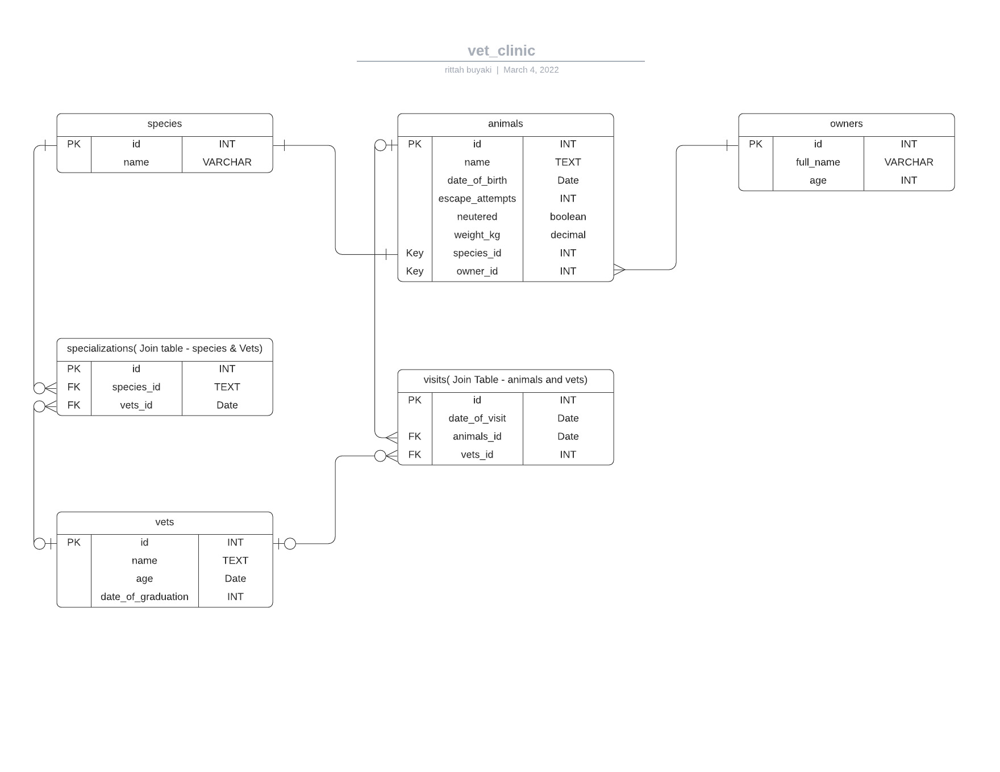

# vet_clinic

> Vet_clinic is a database where we can keep track of animals.

## Getting Started

This repository includes files with plain SQL that can be used to recreate a database:

- Use [schema.sql](./schema.sql) to create all tables.
- Use [data.sql](./data.sql) to populate tables with sample data.
- Check [queries.sql](./queries.sql) for examples of queries that can be run on a newly created database. **Important note: this file might include queries that make changes in the database (e.g., remove records). Use them responsibly!**

## Author

👤 **Ritta Sweta**

- GitHub: [@githubhandle](https://github.com/Buyaki01)
- Twitter: [@twitterhandle](https://twitter.com/BuyakiRitta)
- LinkedIn: [LinkedIn](https://www.linkedin.com/in/ritta-sweta/)

## 🤝 Contributing

Contributions, issues, and feature requests are welcome!

Feel free to check the [issues page](https://github.com/Buyaki01/vet_clinic/issues).

## Show your support

Give a ⭐️ if you like this project!

## Acknowledgments

- Hat tip to anyone whose code was used
- Inspiration
- etc

## 📝 License

This project is [MIT](./MIT.md) licensed.
